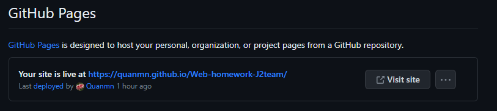
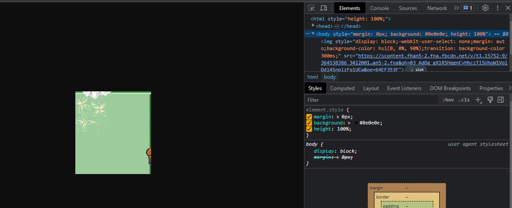
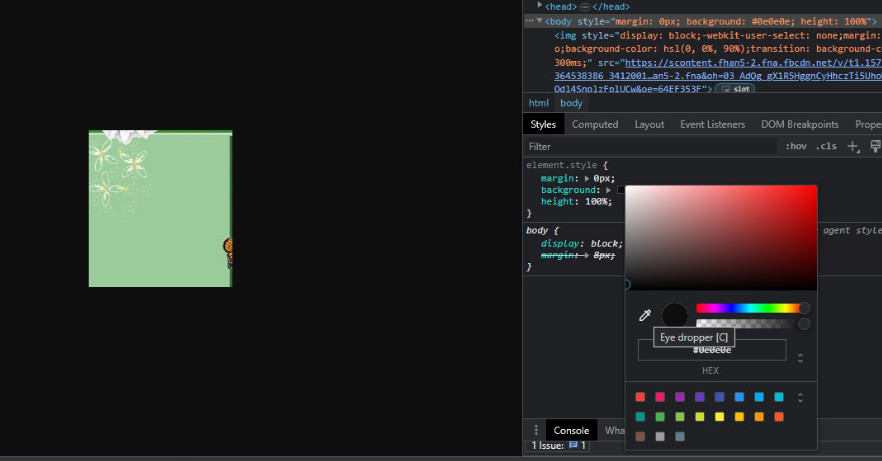

#Cách xem web trên github ☁☁☁
- Đầu tiên ấn vào mục 'Settings hình bánh răng' chọn mục 'Pages'
- Tiếp theo mục 'Branch' chọn nhánh 'master', folder '/(root)' rồi 'save' nó sẽ hiện đường link như này

- Ấn vào link kèm đường dẫn tới file html là có thể share web trên internet tới mọi người: 
- 'Ví dụ': " https://quanmn.github.io/Web-homework-J2team/html/hoa_Canh.html

#Một số tool vip pro ⭐
- extension : 'Visbug' rất nhiều cái tiện lợi như phân bố cục, màu css,... cho front-end web
- Để 'xem màu bức ảnh' ta F12 web đó rồi chọn mục ô màu chỗ 'background: #0e0e0e'

- Rồi lấy cái hình bút chì trỏ vào ảnh là có thể biết được loại color trong ảnh dùng.

🔥🔥🔥🔥🔥🔥🔥🔥🔥🔥🔥🔥🔥🔥🔥🔥🔥🔥🔥🔥🔥🔥🔥🔥🔥🔥🔥🔥🔥🔥🔥🔥🔥🔥🔥🔥🔥🔥🔥🔥🔥🔥🔥🔥🔥🔥🔥🔥🔥🔥🔥🔥